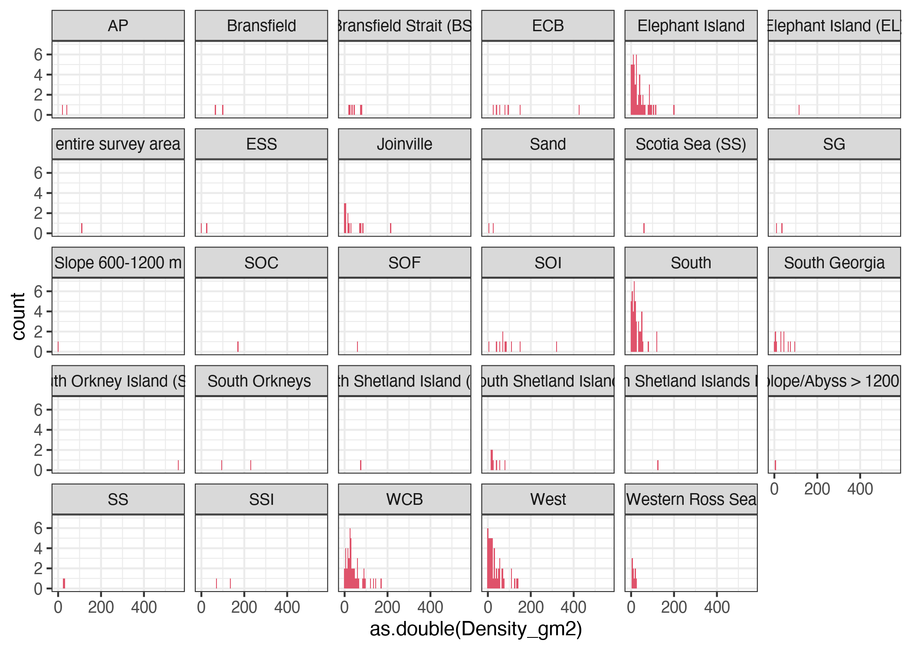
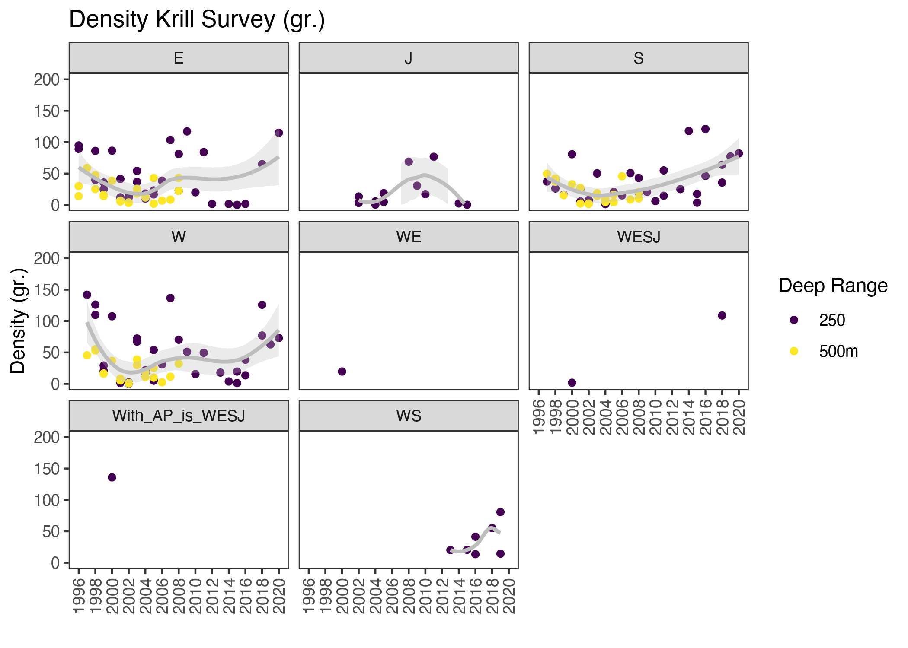
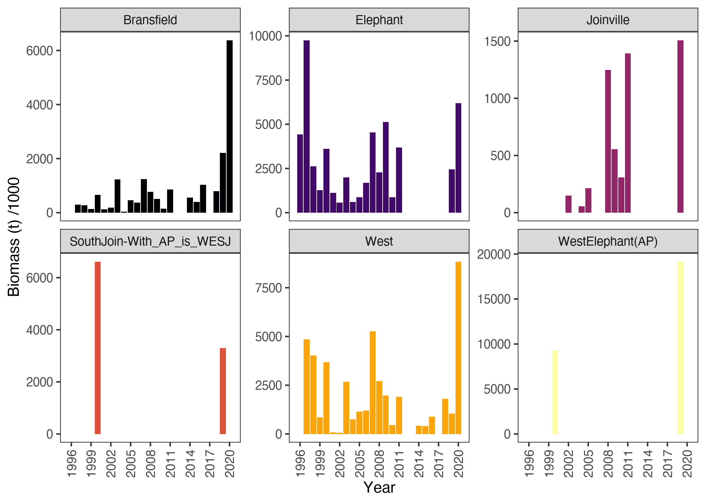
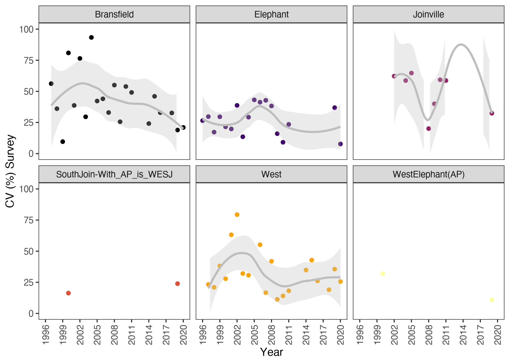
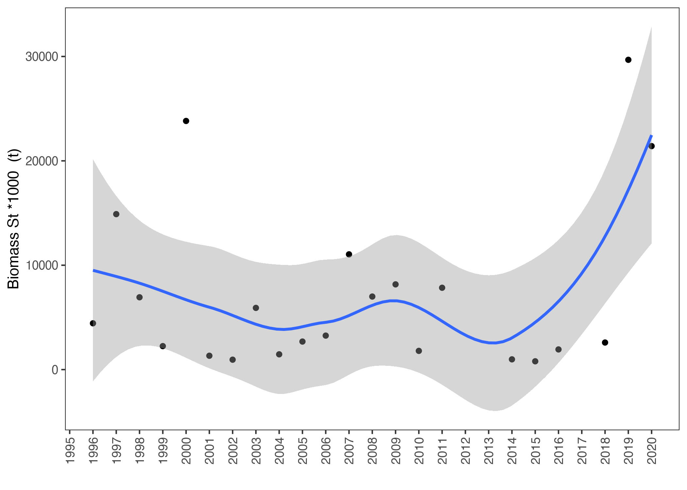

```r
rm(list = ls())
knitr::opts_chunk$set(echo = TRUE,
                      message = FALSE,
                      warning = FALSE,
                      fig.align = 'center',
                      dpi = 300)
#XQuartz is a mess, put this in your onload to default to cairo instead
options(bitmapType = "cairo") 
# (https://github.com/tidyverse/ggplot2/issues/2655)
# Lo mapas se hacen mas rapido
```


```r
library(GGally)
library(tidyverse, quietly = TRUE)
library(patchwork)
library(marmap)
library(ggplot2)
library(raster)
library(dbplyr)
library(knitr)
library(data.table)
```


```r
# Genero una carpeta en donde alojar figuras
dir.Fig        <-"Figuras/"
fig            <-c("pdf","bmp")
```


# BACKGROUND

The following document intends to carry out a complementary
methodological analysis to explore with the
population dynamics of krill (*Euphausia superba*), in this case, with a index of biommass based in AMLR Program Survey with both standarized and calibrated data.


# OBJECTIVE

Once the correlation and effects on the population and/or fishing
indicators on krill have been verified, this analysis aims to have a
time series of the environmental variable to incorporate into the stock assessment process. Similar work in @Wang2021 but with a longest fishery history and adding environmental and predator data.


# METODOLOGY

### Read data and code provided by  WG-EMM-2021/05 Rev.
Different packages was used  in this report like @Yuhui2023, @Ludecke2021, @Report2023. 


```r
mdat <- read.csv("ASAM_metadata_2021_v2_tidy_0.csv")
names(mdat)
```

```
##  [1] "Year..yyyy."                              
##  [2] "Month..MON."                              
##  [3] "Vessel"                                   
##  [4] "Contributor"                              
##  [5] "Subarea"                                  
##  [6] "Survey.name"                              
##  [7] "Density.estimate..g.m.2."                 
##  [8] "CV.of.density.estimate...."               
##  [9] "CV.estimation.method"                     
## [10] "Survey.area..km2."                        
## [11] "Echosounder.model"                        
## [12] "Frequency.used.for.biomass.estimate..kHz."
## [13] "Other.frequencies.available"              
## [14] "Method.used.for.target.identification"    
## [15] "dB.difference.window"                     
## [16] "TS.model.used"                            
## [17] "Depth.range.integrated..m."               
## [18] "Time.of.day.sampled"                      
## [19] "Stratum.name"                             
## [20] "Survey.design.description"                
## [21] "Reference"                                
## [22] "Note"                                     
## [23] "empty1"                                   
## [24] "sourceexl"                                
## [25] "Net"                                      
## [26] "Tow.design"                               
## [27] "ASAM_NOTES"
```

### Tidy and inspect file structure

  1. Checking structure (most data is currently character type)
  2. Renaming columns to be R friendly
  3. Inspect individual column contents for unusual formats or notes prior to type conversion
  

### Names of Data

Set names to be more R Friendly 


|Metadata Table Names                      |R Names                   |
|:-----------------------------------------|:-------------------------|
|Year..yyyy.                               |Year_yyyy                 |
|Month..MON.                               |Month_MON                 |
|Vessel                                    |Vessel                    |
|Contributor                               |Contributor               |
|Subarea                                   |Subarea                   |
|Survey.name                               |Survey_name               |
|Density.estimate..g.m.2.                  |Density_gm2               |
|CV.of.density.estimate....                |CV_of_density_Perc        |
|CV.estimation.method                      |CV_method                 |
|Survey.area..km2.                         |Survey_area_km2           |
|Echosounder.model                         |Echosounder               |
|Frequency.used.for.biomass.estimate..kHz. |Freq_for_biomass_est_kHz  |
|Other.frequencies.available               |Frequencies_avail         |
|Method.used.for.target.identification     |TS_Id_Method              |
|dB.difference.window                      |dB_diff_window            |
|TS.model.used                             |TS_model                  |
|Depth.range.integrated..m.                |Depth_range_integrated_m  |
|Time.of.day.sampled                       |Time_sampled              |
|Stratum.name                              |Stratum_name              |
|Survey.design.description                 |Survey_design_description |
|Reference                                 |Reference                 |
|Note                                      |Note                      |
|empty1                                    |empty1                    |
|sourceexl                                 |sourceexl                 |
|Net                                       |Net                       |
|Tow.design                                |Towdesign                 |
|ASAM_NOTES                                |ASAM_NOTES                |

### Years & Months available:


```r
sort(unique(mdat$Year_yyyy))
```

```
##  [1] 1982 1986 1989 1990 1991 1992 1993 1994 1996 1997 1998 1999 2000 2001 2002
## [16] 2003 2004 2005 2006 2007 2008 2009 2010 2011 2012 2013 2014 2015 2016 2017
## [31] 2018 2019 2020
```

```r
unique(mdat$Month_MON) 
```

```
##  [1] "Dec"             "Jan"             "Oct"             "Mar"            
##  [5] "Nov"             "May"             "Feb"             "Apr"            
##  [9] "Aug"             "Feb-Mar"         "Dec,Jan,Feb,Mar" "Jan, Feb"
```

### Vessels and contributors


```r
unique(mdat$Vessel)
```

```
##  [1] "RRS James Clark Ross" "Atlantida*"           "RRS Discovery"       
##  [4] "RRS John Biscoe"      ""                     "F/V Fu Rong Hai"     
##  [7] "Yuzhmorgeologia"      "Moana Wave"           "Nathaniel B. Palmer" 
## [10] "Polarstern"           "Saga Sea"             "Juvel"               
## [13] "Kronprins Haakon"     "Cariboo"              "Italica"             
## [16] "F/V Kwang Ja"         "RV Tangaroa"          "several"             
## [19] "RV Atlantida"
```

```r
unique(mdat$Contributor)   
```

```
##  [1] "UK"                                           
##  [2] "China"                                        
##  [3] "USA"                                          
##  [4] "Germany, China, Australia"                    
##  [5] "IMR"                                          
##  [6] "IMR, YSFRI, BAS"                              
##  [7] "IMR, YSFRI"                                   
##  [8] "Italy (CNR IRBIM)"                            
##  [9] "Korea "                                       
## [10] "New Zealand"                                  
## [11] "ARK,China,Korea,Norway,Ukraine,United Kingdom"
## [12] "CCAMLR2000"                                   
## [13] "Russia"
```

### Subarea codes
 
Area "48" is the ccamlr 2000 survey and strata

```r
unique(mdat$Subarea) # Area "48" is the ccamlr 2000 survey
```

```
## [1] "48.3"       "48.1"       "48.2"       "88.1"       "48.2, 48.3"
## [6] "48.4"       "48"         "48.1/48.2"
```

```r
unique(mdat$Stratum_name)
```

```
##  [1] "WCB"                          "ECB"                         
##  [3] "South Georgia"                "South Shetland Islands"      
##  [5] "Elephant Island"              "West"                        
##  [7] "South"                        "Joinville"                   
##  [9] "South Orkneys "               "entire survey area"          
## [11] "Bransfield"                   "South Shetland Islands North"
## [13] "SOI"                          "Western Ross Sea"            
## [15] "Slope 600-1200 m"             "Splope/Abyss > 1200 m"       
## [17] "AP"                           "SS"                          
## [19] "ESS"                          "SSI"                         
## [21] "SG"                           "Sand"                        
## [23] "SOF"                          "SOC"                         
## [25] "Scotia Sea (SS)"              "South Shetland Island (SSI)" 
## [27] "Bransfield Strait (BS)"       "Elephant Island (EL)"        
## [29] "South Orkney Island (SOI)"
```

### CV method


```r
unique(mdat$CV_method) 
```

```
## [1] "Jolly and Hampton"                                                                                
## [2] ""                                                                                                 
## [3] "Here, the CV were simply calculated as the S.E/Mean x 100% for each stratum or entire survey area"
## [4] "Bootstrapping"
```
  
There is an unusual entry of CV method:

  "Here, the CV were simply calculated as the S.E/Mean x 100% for each stratum or entire survey area"
  
A note has been added to the "Note" column indicating that "CV calculated as the S.E/Mean x 100% for each stratum or entire survey area"  


 **Data where CV calculated as the S.E/Mean x 100% for each stratum or entire survey area**
 

```r
# INSPECT and add to ASAM_NOTES column
knitr::kable(mdat[mdat$CV_method=="Here, the CV were simply calculated as the S.E/Mean x 100% for each stratum or entire survey area", c(1:8, 10)])
```


|    | Year_yyyy|Month_MON |Vessel     |Contributor               |Subarea |Survey_name               |Density_gm2 |CV_of_density_Perc |Survey_area_km2 |
|:---|---------:|:---------|:----------|:-------------------------|:-------|:-------------------------|:-----------|:------------------|:---------------|
|223 |      2018|Apr       |Polarstern |Germany, China, Australia |48.1    |Germany, China, Australia |108.9       |12.3               |115526          |
|224 |      2018|Apr       |Polarstern |Germany, China, Australia |48.1    |Germany, China, Australia |64          |22.1               |24479           |
|225 |      2018|Apr       |Polarstern |Germany, China, Australia |48.1    |Germany, China, Australia |125.9       |42.7               |29031           |
|226 |      2018|Apr       |Polarstern |Germany, China, Australia |48.1    |Germany, China, Australia |65          |21.7               |43865           |
|227 |      2018|Apr       |Polarstern |Germany, China, Australia |48.1    |Germany, China, Australia |213.7       |10.4               |18151           |

### Echosounder used:


```r
unique(mdat$Echosounder)
```

```
##  [1] "EK500"               "EK60"                "EKS120 QM"          
##  [4] "EK400 QD"            "EK400 ESP"           "Simrad EK60"        
##  [7] "ES60"                "EK80"                "BioSonics 102"      
## [10] "EK60 "               "EK60,ES70,ES80,EK80"
```

### Frequency used for biomass estimation, TS method and TS model


```r
unique(mdat$Freq_for_biomass_est_kHz)
```

```
## [1] 120  70  38
```

```r
unique(mdat$TS_Id_Method)
```

```
##  [1] "dB difference (120-38 & 200-120)"             
##  [2] "dB difference (120-38)"                       
##  [3] "All signal"                                   
##  [4] "Visual"                                       
##  [5] "Swarms identification"                        
##  [6] "dB difference (120-70)"                       
##  [7] "dB difference (120-70)***"                    
##  [8] "dB difference (120-38, 200-38, 200-120)"      
##  [9] "acoustic fingerprint at 38, 120, 200"         
## [10] "dB difference"                                
## [11] "Multifrequency response, swarms idenification"
```

```r
unique(mdat$TS_model)
```

```
##  [1] "full SDWBA (ASAM 2010 parameterisation)"            
##  [2] "Greene et al. 1991"                                 
##  [3] "Fluid sphere model. TS equation: Greene et al. 1991"
##  [4] "Fluid sphere model. TS equation: Greene et al. 1992"
##  [5] "Fluid sphere model. TS equation: Greene et al. 1993"
##  [6] "Fluid sphere model. TS equation: Greene et al. 1994"
##  [7] "Fluid sphere model. TS equation: Greene et al. 1995"
##  [8] "Fluid sphere model. TS equation: Greene et al. 1996"
##  [9] "Fluid sphere model. TS equation: Greene et al. 1997"
## [10] "Fluid sphere model. TS equation: Greene et al. 1998"
## [11] "Fluid sphere model. TS equation: Greene et al. 1999"
```

### Depth range integrated


```r
unique(mdat$Depth_range_integrated_m)
```

```
## [1] "250"  ""     "500m" "200"
```

### Time of samples


```r
unique(mdat$Time_sampled) # ? should we consolidate "daylight only" to be "day"
```

```
## [1] "daylight only" "day and night" "day"
```

### Stratum names and codes

To ease coding new strata codes were set up for Area 48.1 data under col 'strata'.  

Strata that were assigned a code based on the area they matched best.  

Surveys which overlapped multiple areas were assigned combined codes.


```r
unique(mdat$Stratum_name)
```

```
##  [1] "WCB"                          "ECB"                         
##  [3] "South Georgia"                "South Shetland Islands"      
##  [5] "Elephant Island"              "West"                        
##  [7] "South"                        "Joinville"                   
##  [9] "South Orkneys "               "entire survey area"          
## [11] "Bransfield"                   "South Shetland Islands North"
## [13] "SOI"                          "Western Ross Sea"            
## [15] "Slope 600-1200 m"             "Splope/Abyss > 1200 m"       
## [17] "AP"                           "SS"                          
## [19] "ESS"                          "SSI"                         
## [21] "SG"                           "Sand"                        
## [23] "SOF"                          "SOC"                         
## [25] "Scotia Sea (SS)"              "South Shetland Island (SSI)" 
## [27] "Bransfield Strait (BS)"       "Elephant Island (EL)"        
## [29] "South Orkney Island (SOI)"
```

### Survey design


```r
unique(mdat$Survey_design_description)
```

```
## [1] "Parallel transects"        "Radial transects"         
## [3] ""                          "Transect"                 
## [5] "zig-zag transects"         "O'Driscoll et al (2010)"  
## [7] "As per CCAMLR 2000 survey"
```

### Notes/Comments


```r
unique(mdat$Note)
```

```
## [1] "See map"                                                                                                                                                         
## [2] ""                                                                                                                                                                
## [3] "* my understanding that Atlantida did the WCB during the CCAMLR 2000 survey"                                                                                     
## [4] "Greene and two frequency fixed window presented in Reid et al. 2010"                                                                                             
## [5] "Brierley AS, Goss C, Grant SA, Watkins JA, Reid K, Belchier M, Everson I, Jessop MJ, Afanasyev V, Robst J. 2002 CCAMLR Science 9: 71-82"                         
## [6] "dB-difference window was applied to the detected aggregations  following the swarm-based identification method template by SG-ASAM 2017"                         
## [7] "As a contribution to the joint effort on the large-scale krill survey in Area 48, 2019"                                                                          
## [8] "see inset map for schematic display of sampling strata -- Joinville stratum includes the tracklines and stations that are not included in the other three strata"
## [9] "200kHz is questionable for 2015, due to calibration. It wasn't used in 2016"
```

```r
unique(mdat$empty1)
```

```
## [1] ""                                                                                                                                                                                                                                                                                                     
## [2] "Reid K, Watkins JA, Murphy EJ, Trathan PN, Fielding S, Enderlein P. 2010 Marine Ecology Progress Series 399: 243-252"                                                                                                                                                                                 
## [3] "Fielding S., Watkins, J.L., Trathan, P., Enderlein, P., Waluda, C., Stowasser G., Tarling G.A., Murphy E.J. (2014) Inter-annual variability in Antarctic krill (Euphausia superba) density at South Georgia, Southern Ocean: 1997 – 2012. ICES Journal of Marine Sciences. doi:10.1093/icesjms/fsu104"
## [4] "Fielding S. (2018) Comparing two and three frequency dB window identification techniques for estimating Antarctic krill density. SG-ASAM-18/01"                                                                                                                                                       
## [5] "Brierley, A.S., Watkins, J.L., Goss, C., Wilkinson, M.T. and Everson, I. (1999) Acoustic estimates of krill density at South Georgia, 1981 to 1998. CCAMLR Science, 6: 47-57."
```

```r
unique(mdat$ASAM_NOTES)
```

```
## [1] ""                                                                                                  
## [2] "Same surveys as above, but done with Greene model"                                                 
## [3] "*No density estimate due to low proportion of survey area covered_**Reduced coverage due to ice  " 
## [4] "**Reduced coverage due to ice_***This frequency combination does not work well for discrimination "
## [5] "*Reduced spatial extent due to ice cover"                                                          
## [6] "**reduced coverage due to time constraints"
```

```r
#mdat[mdat$ASAM_NOTES=="", mdat$ASAM_NOTES=="NA"] # getting rid of empty ""
```

### Survey details

Tow design. 
Nets.
Source exl. 


```r
unique(mdat$Towdesign)
```

```
## [1] ""                                   "Non-targeted Oblique"              
## [3] "Non-targeted Oblique haul to 250 m"
```

```r
unique(mdat$Net)
```

```
## [1] ""          "1.8m IKMT" "6m2 IMKT"
```

```r
unique(mdat$sourceexl)
```

```
##  [1] "GBR"      "CHN"      "USA"      "GER"      "NOR"      "ITA"     
##  [7] "KOR"      "NZL"      "synoptic" ""
```


### Remove Duplicate and Bad data

As analysis requires Density CV and Area for weighted density calculations:
 
  1.	Remove rows which do not have complete records for ‘Density’ and/or ‘CV’ 
  2.	Remove anything with a comment in the ‘ASAM_NOTES’ because this was either
    a.	the same AMLR data but run with the Greene algorithm so DUPLICATED 
    b.	incomplete/the area wasn’t covered properly so difficult to weight appropriately

**Removed data is being saved in a table named remdat**


```r
# Retain a data.table with data removed
#remdat <- mdat[is.na(mdat$ASAM_NOTES)]

# Remove duplicated or other data with comments in ASAM_NOTES
#mdat <- mdat[is.na(mdat$ASAM_NOTES)]
```
 
### Density 

Take look densities


```r
unique(mdat$Density_gm2)
```

```
##   [1] "31.7"        "96.3"        "38.9"        "427.4"       "9.7"        
##   [6] "23.7"        "2.7"         "1.6"         "36.7"        "5.7"        
##  [11] "2.2"         "137"         "13.6"        "44.3"        "84.6"       
##  [16] "168.9"       "12.9"        "26.1"        "93.2"        "55.6"       
##  [21] "89.4"        "30.4"        "67"          "119.1"       "144.4"      
##  [26] "38.7"        "61.1"        "17.2"        "6.2"         "25.9"       
##  [31] "28.8"        "15"          "59"          "90.1"        "61.8"       
##  [36] "31.2"        "25.4"        "45.2"        "29.2"        "24.8"       
##  [41] "21.2"        "11.7"        "29.7"        "45.1"        "75.1"       
##  [46] "6.4"         "95"          "65.8"        "7.4"         "1.9"        
##  [51] "26.7"        "40.6"        "25.2"        "54.7"        "21.4"       
##  [56] "151"         "3.5"         "34.7"        "51.6"        "47.2"       
##  [61] "80.4"        "32.1"        "7.8"         "20.22"       "20.57"      
##  [66] "41.47"       "55.16"       "80.74"       "89.2"        "94.7"       
##  [71] "202.1"       "86.1"        "39.8"        "25"          "35.7"       
##  [76] "86.4"        "41.4"        "12.1"        "13.9"        "54.2"       
##  [81] "10"          "18.1"        "23"          "16.8"        "38.6"       
##  [86] "103.4"       "81.1"        "22.6"        "117.07"      "20.1"       
##  [91] "84.1"        "141.9"       "109.9"       "126.2"       "29.1"       
##  [96] "20.7"        "107.6"       "1.4"         "3.6"         "2.4"        
## [101] "0.4"         "67.3"        "72.2"        "21.7"        "17.3"       
## [106] "5.1"         "54"          "30.9"        "136.7"       "70.3"       
## [111] "51.028"      "15.57"       "49.5"        "37.3"        "26.2"       
## [116] "41.5"        "16.5"        "80.7"        "25.6"        "5.6"        
## [121] "7.1"         "50.3"        "50.2"        "1.2"         "2"          
## [126] "17.085"      "20.5"        "15.2"        "50.7"        "43"         
## [131] "19.7"        "20.8"        "6.1"         "55"          "14.6"       
## [136] "3.2"         "13.4"        "0.5"         "18.7"        "4.8"        
## [141] "68.8"        "30.6"        "17.1"        "76.7"        "229.9"      
## [146] "95.3"        "1.58"        "1.5"         "0.15"        "1.5676"     
## [151] "3.8"         "1.3"         "13.55"       "117.8"       "121"        
## [156] "0.3"         "29.93"       "14"          "58.84"       "47.56"      
## [161] "25.26"       "14.09"       "16.37"       "38.71"       "5.47"       
## [166] "6.91"        "4"           "3.11"        "18.22"       "12.24"      
## [171] "11.9"        "42.8"        "1.86"        "6.83"        "8.41"       
## [176] "49.68"       "36.97"       "42.11"       "15.55"       "32.87"      
## [181] "27.19"       "2.16"        "2.23"        "1.38"        "14.45"      
## [186] "18.73"       "9.51"        "4.59"        "16.38"       "4.52"       
## [191] "45.72"       "8.65"        "20.46"       "10.3"        "45.5"       
## [196] "55.24"       "53.19"       "16.49"       "16.29"       "36.62"      
## [201] "5.43"        "8.46"        "0.86"        "1.39"        "29.89"      
## [206] "18.36"       "10.78"       "25.5"        "9.95"        "2.53"       
## [211] "11.43"       "108.9"       "64"          "125.9"       "65"         
## [216] "213.7"       "108.69"      "86.93"       "*"           "148.29"     
## [221] "57.19"       "42.23"       "71.09"       "69.87"       "8.278307498"
## [226] "9.146525297" "21.85394976" "21.77390952" "16.30624753" "5.922502164"
## [231] "5.259348377" "26.48023705" "5.38226619"  "13.64"       "24.57"      
## [236] "14.48"       "0.93"        "5.58"        "40.47688092" "25.89848421"
## [241] "23.857455"   "67.72112684" "77.83964515" "9.092878215" "25.9440078" 
## [246] "56.03156687" "9.888204883" "102.4346965" "83.01170926" "58.99355769"
## [251] "170.5593277" "22.33682075" "19.6"        "31.47"       "1.8"        
## [256] "136"         "319.4"       "33.8"        "58.48"       "73.06"      
## [261] "82.05"       "114.93"      "557.81"      "17.95"       "19.57"      
## [266] "38.47"       "76.99"       "62.85"       "25.13"       "17.62"      
## [271] "46.15"       "35.6"        "77.17"
```


```r
mdat$Density_gm2<- as.double(mdat$Density_gm2)
h <- ggplot(mdat, aes(x=as.double(Density_gm2)))+
  geom_histogram(binwidth=5, show.legend = FALSE, fill=2)+
  facet_wrap(~Stratum_name, ncol =6)+
  theme_bw()
h
```



A plot with density in grs. by stratum


```r
sc <- ggplot(mdat, aes(x=Year_yyyy, y=as.double(mdat$Density_gm2))) + 
        geom_point() +
        geom_smooth(method = "loess", colour='red', fill='red', alpha=.3)+
        scale_x_continuous(breaks = seq(from = 190, to = 2019, by = 4))+
        theme_bw()+
        theme(axis.text.x  = element_text(angle=90, vjust=0.5, size=9))+
        theme(axis.text.x = element_text(angle = 90, hjust = 2))+
        facet_wrap(~Stratum_name, ncol =6)+
        ggtitle('Density Krill Survey (gr.)')+
        ylim(0,400)+
        xlim(1995,2020)
sc
```


 
### CV

Some CV values are 95% CI range rather than actual CV.

Remove from analysis data set (store in remdat).


```r
unique(mdat$CV_of_density_Perc)
```

```
##   [1] "26"               "14.3"             "28"              
##   [4] "20.1"             "19.8"             "57.8"            
##   [7] "35.5"             "18.3"             "27.5"            
##  [10] "61.4"             "88.6"             "30.1"            
##  [13] "37.8"             "57.9"             "43.1"            
##  [16] "44.4"             "9.8"              "62.1"            
##  [19] "40.6"             "60.6"             "38.9"            
##  [22] "57.4"             "44.9"             "25.6"            
##  [25] "47"               "26.2"             "70"              
##  [28] "57"               "44.7"             "11.8"            
##  [31] "46.6"             "46.2"             "39.1"            
##  [34] "29.8"             "41.7"             "18.5"            
##  [37] "86.1"             "26.1"             "9.5"             
##  [40] "47.2"             "44"               "21"              
##  [43] "53.2"             "15"               "34.6"            
##  [46] "15.5"             "20.3"             "28.8"            
##  [49] "9"                "17.1"             "11.1"            
##  [52] "19.6"             "65.6"             "30.7"            
##  [55] "33.5"             "26.5"             "43.6"            
##  [58] "63.6"             "68.1"             "22.91"           
##  [61] "28.53"            "18.9"             "17.68"           
##  [64] "13.07"            "21.8"             "30"              
##  [67] "29.7"             "13.9"             "24.2"            
##  [70] "36.1"             "25"               "21.5"            
##  [73] "16.95"            "21.6"             "39.6"            
##  [76] "37.1"             "10.6"             "17.8"            
##  [79] "20.2"             "48"               "30.2"            
##  [82] "41.3"             "42.8"             "31.8"            
##  [85] "48.9"             "16"               "9.1"             
##  [88] "23.5"             "23.3"             "17.6"            
##  [91] "23.1"             "37.2"             "27.9"            
##  [94] "54.7"             "58.3"             "64.5"            
##  [97] "68.6"             "19"               "40.1"            
## [100] "20.6"             "41.5"             "60.2"            
## [103] "80.5"             "55.2"             "16.7"            
## [106] "41.9"             "11.3"             "14.1"            
## [109] "18.2"             "56.2"             "49.5"            
## [112] "9.6"              "80.9"             "30.6"            
## [115] "96.1"             "32.1"             "26.8"            
## [118] "58.5"             "99.6"             "16.04"           
## [121] "53.1"             "33"               "48.8"            
## [124] "63.2"             "25.57"            "53.9"            
## [127] "43.3"             "8.6"              "54.5"            
## [130] "115"              "44.5"             "55.9"            
## [133] "52.1"             "40"               "59.3"            
## [136] "58.7"             "46.8"             "33.6"            
## [139] "51"               "29.1"             "30.4"            
## [142] "51.78"            "51.9"             "60.7"            
## [145] "71.85"            "37.4"             "27.6"            
## [148] "55.28"            "52.2"             "62.7"            
## [151] "28.98"            "28.89"            "21.29"           
## [154] "14.43"            "15.47"            "40.63"           
## [157] "37.58"            "25.62"            "20.61"           
## [160] "10.83"            "42.05"            "21.71"           
## [163] "8.44"             "20.23"            "17.18"           
## [166] "23.76"            "17.81"            "20.96"           
## [169] "32.08"            "36.5"             "32.7"            
## [172] "47.5"             "69.19"            "17.22"           
## [175] "12.63"            "13.47"            "32.11"           
## [178] "60.24"            "52.7"             "44.88"           
## [181] "40.67"            "23.9"             "25.06"           
## [184] "26.21"            "88.82"            "14.08"           
## [187] "39.01"            "15.95"            "42.56"           
## [190] "50.9"             "62.2"             "28.04"           
## [193] "19.24"            "23.57"            "31.22"           
## [196] "33.35"            "33.15"            "19.95"           
## [199] "38.92"            "54.25"            "16.5"            
## [202] "21.25"            "9.26"             "43.25"           
## [205] "18.47"            "62.81"            "22.85"           
## [208] "21.44"            "12.3"             "22.1"            
## [211] "42.7"             "21.7"             "10.4"            
## [214] "18"               "32"               ""                
## [217] "41"               "49"               "45"              
## [220] "46.13"            "39.83"            "44.45"           
## [223] "95%CI 0-6.42"     "95%CI 0.21-11.29" "10.98898388"     
## [226] "26.19352013"      "16.24168617"      "23.91574601"     
## [229] "30.53981024"      "22.2208224"       "16.16530256"     
## [232] "36.89290425"      "18.22463023"      "18.29492378"     
## [235] "32.39759521"      "65.16650117"      "27.54752975"     
## [238] "19.5615218"       "31.91"            "38.2"            
## [241] "16.32"            "55"               "35.7"            
## [244] "10.91"            "7.73"             "34.87"           
## [247] "42.84"            "26.16"            "19.05"           
## [250] "26.65"            "24.13"            "46.02"           
## [253] "32.89"            "32.65"            "19.65"
```

```r
mdat$CV_of_density_Perc <- as.double(mdat$CV_of_density_Perc)
hist(mdat$CV_of_density_Perc, breaks = 100)
```


```r
# 
# knitr::kable(mdat[CV_of_density_Perc=="95%CI 0-6.42"|CV_of_density_Perc=="95%CI 0.21-11.29", 1:10])
# 
# # The above do not have CV values we can work with so removing them from analysis
# remdat <- rbind(remdat,  mdat[CV_of_density_Perc %in% c("95%CI 0-6.42", "95%CI 0.21-11.29")])
# mdat <- mdat[!CV_of_density_Perc %in% c("95%CI 0-6.42", "95%CI 0.21-11.29")]
```
### Stratum names and codes

To ease coding new strata codes were set up for Area 48.1 data under col 'strata'.  

Strata that were assigned a code based on the area they matched best.  

Surveys which overlapped multiple areas were assigned combined codes.


```r
unique(mdat$Stratum_name)
```

```
##  [1] "WCB"                          "ECB"                         
##  [3] "South Georgia"                "South Shetland Islands"      
##  [5] "Elephant Island"              "West"                        
##  [7] "South"                        "Joinville"                   
##  [9] "South Orkneys "               "entire survey area"          
## [11] "Bransfield"                   "South Shetland Islands North"
## [13] "SOI"                          "Western Ross Sea"            
## [15] "Slope 600-1200 m"             "Splope/Abyss > 1200 m"       
## [17] "AP"                           "SS"                          
## [19] "ESS"                          "SSI"                         
## [21] "SG"                           "Sand"                        
## [23] "SOF"                          "SOC"                         
## [25] "Scotia Sea (SS)"              "South Shetland Island (SSI)" 
## [27] "Bransfield Strait (BS)"       "Elephant Island (EL)"        
## [29] "South Orkney Island (SOI)"
```


```r
mdat$strata[mdat$Stratum_name%in%c("Elephant Island", "Elephant Island (EL)")] <- "E"    
mdat$strata[mdat$Stratum_name%in%c("Joinville")] <- "J"    
mdat$strata[mdat$Stratum_name%in%c("South", "Bransfield",  "Bransfield Strait (BS)")] <- "S"    
mdat$strata[mdat$Stratum_name%in%c("West", "South Shetland Islands North", "South Shetland Island (SSI)")] <- "W"   
mdat$strata[mdat$Stratum_name%in%c("ESS", "entire survey area")] <- "WESJ"   
mdat$strata[mdat$Stratum_name%in%c("AP")] <- "WE"   
mdat$strata[mdat$Stratum_name%in%c("South Shetland Islands")] <- "WS"   
mdat$strata[mdat$Stratum_name%in%c("SSI")] <- "With_AP_is_WESJ"   
table(mdat$strata)
```

```
## 
##               E               J               S               W              WE 
##              54              14              53              52               2 
##            WESJ With_AP_is_WESJ              WS 
##               3               2               8
```

```r
# test NA Data
colSums(is.na(mdat))
```

```
##                 Year_yyyy                 Month_MON                    Vessel 
##                         0                         0                         0 
##               Contributor                   Subarea               Survey_name 
##                         0                         0                         0 
##               Density_gm2        CV_of_density_Perc                 CV_method 
##                         1                        12                         0 
##           Survey_area_km2               Echosounder  Freq_for_biomass_est_kHz 
##                         0                         0                         0 
##         Frequencies_avail              TS_Id_Method            dB_diff_window 
##                         0                         0                        17 
##                  TS_model  Depth_range_integrated_m              Time_sampled 
##                         0                         0                         0 
##              Stratum_name Survey_design_description                 Reference 
##                         0                         0                         0 
##                      Note                    empty1                 sourceexl 
##                         0                         0                         0 
##                       Net                 Towdesign                ASAM_NOTES 
##                         0                         0                         0 
##                    strata 
##                        98
```

```r
# drop NA in Strata
mdat1 <- mdat %>% 
  drop_na()
```


```r
destra <- ggplot(mdat1, 
                 aes(x=Year_yyyy, 
                     y=as.double(mdat1$Density_gm2),
                     color=TS_Id_Method)) +
  geom_point() +
  geom_smooth(method = "loess", colour='grey', fill='grey', alpha=.3)+
  scale_x_continuous(breaks = seq(from = 1990, to = 2020, by = 2))+
  scale_color_viridis_d(option = "E")+
  theme_bw()+
  theme(axis.text.x  = element_text(angle=90, vjust=0.5, size=9),
        panel.grid.major = element_line(colour = "white", size = 0.1),
        panel.grid.minor = element_line(colour = "white", size = 0.1))+
  facet_wrap(~strata, ncol =3)+
  ggtitle('Density Krill Survey (gr.)')+
  ylim(0,200)+
  labs(y="Density (gr.)",
       x= "")
destra
```


```r
destra <- ggplot(mdat1, 
                 aes(x=Year_yyyy, 
                     y=as.double(mdat1$Density_gm2),
                     color=Depth_range_integrated_m)) +
  geom_point() +
  geom_smooth(method = "loess", 
              colour='grey', 
              fill='grey', alpha=.3)+
  scale_x_continuous(breaks = seq(from = 1990, to = 2020, by = 2))+
  scale_color_viridis_d(option = "D",
                        name="Deep Range")+
  theme_bw()+
  theme(axis.text.x  = element_text(angle=90, vjust=0.5, size=9),
        panel.grid.major = element_line(colour = "white", size = 0.1),
        panel.grid.minor = element_line(colour = "white", size = 0.1))+
  facet_wrap(~strata, ncol =3)+
  ggtitle('Density Krill Survey (gr.)')+
  ylim(0,200)+
  labs(y="Density (gr.)",
       x= "")
destra
```


Some statistics descriptive


```r
library(pastecs)
descrs <- stat.desc(mdat[,c(7,8, 12)])
kable(descrs,
      format="html",
      digits = 3)
```

<table>
 <thead>
  <tr>
   <th style="text-align:left;">   </th>
   <th style="text-align:right;"> Density_gm2 </th>
   <th style="text-align:right;"> CV_of_density_Perc </th>
   <th style="text-align:right;"> Freq_for_biomass_est_kHz </th>
  </tr>
 </thead>
<tbody>
  <tr>
   <td style="text-align:left;"> nbr.val </td>
   <td style="text-align:right;"> 285.000 </td>
   <td style="text-align:right;"> 274.000 </td>
   <td style="text-align:right;"> 286.000 </td>
  </tr>
  <tr>
   <td style="text-align:left;"> nbr.null </td>
   <td style="text-align:right;"> 0.000 </td>
   <td style="text-align:right;"> 0.000 </td>
   <td style="text-align:right;"> 0.000 </td>
  </tr>
  <tr>
   <td style="text-align:left;"> nbr.na </td>
   <td style="text-align:right;"> 1.000 </td>
   <td style="text-align:right;"> 12.000 </td>
   <td style="text-align:right;"> 0.000 </td>
  </tr>
  <tr>
   <td style="text-align:left;"> min </td>
   <td style="text-align:right;"> 0.150 </td>
   <td style="text-align:right;"> 7.730 </td>
   <td style="text-align:right;"> 38.000 </td>
  </tr>
  <tr>
   <td style="text-align:left;"> max </td>
   <td style="text-align:right;"> 557.810 </td>
   <td style="text-align:right;"> 115.000 </td>
   <td style="text-align:right;"> 120.000 </td>
  </tr>
  <tr>
   <td style="text-align:left;"> range </td>
   <td style="text-align:right;"> 557.660 </td>
   <td style="text-align:right;"> 107.270 </td>
   <td style="text-align:right;"> 82.000 </td>
  </tr>
  <tr>
   <td style="text-align:left;"> sum </td>
   <td style="text-align:right;"> 12635.910 </td>
   <td style="text-align:right;"> 9562.191 </td>
   <td style="text-align:right;"> 34106.000 </td>
  </tr>
  <tr>
   <td style="text-align:left;"> median </td>
   <td style="text-align:right;"> 25.944 </td>
   <td style="text-align:right;"> 30.470 </td>
   <td style="text-align:right;"> 120.000 </td>
  </tr>
  <tr>
   <td style="text-align:left;"> mean </td>
   <td style="text-align:right;"> 44.337 </td>
   <td style="text-align:right;"> 34.899 </td>
   <td style="text-align:right;"> 119.252 </td>
  </tr>
  <tr>
   <td style="text-align:left;"> SE.mean </td>
   <td style="text-align:right;"> 3.431 </td>
   <td style="text-align:right;"> 1.118 </td>
   <td style="text-align:right;"> 0.440 </td>
  </tr>
  <tr>
   <td style="text-align:left;"> CI.mean.0.95 </td>
   <td style="text-align:right;"> 6.753 </td>
   <td style="text-align:right;"> 2.200 </td>
   <td style="text-align:right;"> 0.866 </td>
  </tr>
  <tr>
   <td style="text-align:left;"> var </td>
   <td style="text-align:right;"> 3354.662 </td>
   <td style="text-align:right;"> 342.222 </td>
   <td style="text-align:right;"> 55.396 </td>
  </tr>
  <tr>
   <td style="text-align:left;"> std.dev </td>
   <td style="text-align:right;"> 57.919 </td>
   <td style="text-align:right;"> 18.499 </td>
   <td style="text-align:right;"> 7.443 </td>
  </tr>
  <tr>
   <td style="text-align:left;"> coef.var </td>
   <td style="text-align:right;"> 1.306 </td>
   <td style="text-align:right;"> 0.530 </td>
   <td style="text-align:right;"> 0.062 </td>
  </tr>
</tbody>
</table>

```r
skimr::skim(mdat)
```


Table: Data summary

|                         |     |
|:------------------------|:----|
|Name                     |mdat |
|Number of rows           |286  |
|Number of columns        |28   |
|_______________________  |     |
|Column type frequency:   |     |
|character                |24   |
|numeric                  |4    |
|________________________ |     |
|Group variables          |None |


**Variable type: character**

|skim_variable             | n_missing| complete_rate| min| max| empty| n_unique| whitespace|
|:-------------------------|---------:|-------------:|---:|---:|-----:|--------:|----------:|
|Month_MON                 |         0|          1.00|   3|  15|     0|       12|          0|
|Vessel                    |         0|          1.00|   0|  20|     1|       19|          0|
|Contributor               |         0|          1.00|   2|  45|     0|       13|          0|
|Subarea                   |         0|          1.00|   2|  10|     0|        8|          0|
|Survey_name               |         0|          1.00|   0|  34|    15|      107|          0|
|CV_method                 |         0|          1.00|   0|  97|    10|        4|          0|
|Survey_area_km2           |         0|          1.00|   0|  11|    17|       60|          0|
|Echosounder               |         0|          1.00|   4|  19|     0|       11|          0|
|Frequencies_avail         |         0|          1.00|   0|  20|     7|       10|          0|
|TS_Id_Method              |         0|          1.00|   6|  45|     0|       11|          0|
|dB_diff_window            |        17|          0.94|   0|  22|     6|        8|          0|
|TS_model                  |         0|          1.00|  18|  51|     0|       11|          0|
|Depth_range_integrated_m  |         0|          1.00|   0|   4|    22|        4|          0|
|Time_sampled              |         0|          1.00|   3|  13|     0|        3|          0|
|Stratum_name              |         0|          1.00|   2|  28|     0|       29|          0|
|Survey_design_description |         0|          1.00|   0|  25|   155|        7|          0|
|Reference                 |         0|          1.00|   0| 313|   132|       24|          0|
|Note                      |         0|          1.00|   0| 160|   255|        9|          0|
|empty1                    |         0|          1.00|   0| 293|   282|        5|          0|
|sourceexl                 |         0|          1.00|   0|   8|     1|       10|          0|
|Net                       |         0|          1.00|   0|   9|   127|        3|          0|
|Towdesign                 |         0|          1.00|   0|  34|   127|        3|          0|
|ASAM_NOTES                |         0|          1.00|   0|  98|   221|        6|          0|
|strata                    |        98|          0.66|   1|  15|     0|        8|          0|


**Variable type: numeric**

|skim_variable            | n_missing| complete_rate|    mean|    sd|      p0|     p25|     p50|     p75|    p100|hist  |
|:------------------------|---------:|-------------:|-------:|-----:|-------:|-------:|-------:|-------:|-------:|:-----|
|Year_yyyy                |         0|          1.00| 2005.75|  7.73| 1982.00| 2000.00| 2004.00| 2011.75| 2020.00|▁▂▇▅▅ |
|Density_gm2              |         1|          1.00|   44.34| 57.92|    0.15|   11.70|   25.94|   57.19|  557.81|▇▁▁▁▁ |
|CV_of_density_Perc       |        12|          0.96|   34.90| 18.50|    7.73|   20.38|   30.47|   44.98|  115.00|▇▆▃▁▁ |
|Freq_for_biomass_est_kHz |         0|          1.00|  119.25|  7.44|   38.00|  120.00|  120.00|  120.00|  120.00|▁▁▁▁▇ |
In this part we star to work with procesed data from WG-EEM-21

## Biomass data
Load Biomass depured data


```r
bioma <- read_csv("krill_biomass_acoustic_survey.csv")
View(bioma)
```
Some statistics to biomass calculation


```r
descrsbio <- stat.desc(bioma[,c(-1)])
kable(descrsbio,
      format="html",
      digits = 3)
```

<table>
 <thead>
  <tr>
   <th style="text-align:left;">   </th>
   <th style="text-align:right;"> Year </th>
   <th style="text-align:right;"> N </th>
   <th style="text-align:right;"> wtgm2 </th>
   <th style="text-align:right;"> wtvardens </th>
   <th style="text-align:right;"> cv </th>
   <th style="text-align:right;"> areakm2 </th>
   <th style="text-align:right;"> minarea </th>
   <th style="text-align:right;"> maxarea </th>
   <th style="text-align:right;"> strataarea </th>
   <th style="text-align:right;"> stratabiomass </th>
   <th style="text-align:right;"> cvbiomass </th>
   <th style="text-align:right;"> areaamlr </th>
   <th style="text-align:right;"> amlrbiomass </th>
   <th style="text-align:right;"> cvamlrbiomm </th>
  </tr>
 </thead>
<tbody>
  <tr>
   <td style="text-align:left;"> nbr.val </td>
   <td style="text-align:right;"> 72.000 </td>
   <td style="text-align:right;"> 72.000 </td>
   <td style="text-align:right;"> 72.000 </td>
   <td style="text-align:right;"> 72.000 </td>
   <td style="text-align:right;"> 72.000 </td>
   <td style="text-align:right;"> 7.200000e+01 </td>
   <td style="text-align:right;"> 7.200000e+01 </td>
   <td style="text-align:right;"> 7.200000e+01 </td>
   <td style="text-align:right;"> 7.200000e+01 </td>
   <td style="text-align:right;"> 7.200000e+01 </td>
   <td style="text-align:right;"> 72.000 </td>
   <td style="text-align:right;"> 7.200000e+01 </td>
   <td style="text-align:right;"> 7.200000e+01 </td>
   <td style="text-align:right;"> 72.000 </td>
  </tr>
  <tr>
   <td style="text-align:left;"> nbr.null </td>
   <td style="text-align:right;"> 0.000 </td>
   <td style="text-align:right;"> 0.000 </td>
   <td style="text-align:right;"> 0.000 </td>
   <td style="text-align:right;"> 0.000 </td>
   <td style="text-align:right;"> 0.000 </td>
   <td style="text-align:right;"> 0.000000e+00 </td>
   <td style="text-align:right;"> 0.000000e+00 </td>
   <td style="text-align:right;"> 0.000000e+00 </td>
   <td style="text-align:right;"> 0.000000e+00 </td>
   <td style="text-align:right;"> 0.000000e+00 </td>
   <td style="text-align:right;"> 0.000 </td>
   <td style="text-align:right;"> 0.000000e+00 </td>
   <td style="text-align:right;"> 0.000000e+00 </td>
   <td style="text-align:right;"> 0.000 </td>
  </tr>
  <tr>
   <td style="text-align:left;"> nbr.na </td>
   <td style="text-align:right;"> 0.000 </td>
   <td style="text-align:right;"> 0.000 </td>
   <td style="text-align:right;"> 0.000 </td>
   <td style="text-align:right;"> 0.000 </td>
   <td style="text-align:right;"> 0.000 </td>
   <td style="text-align:right;"> 0.000000e+00 </td>
   <td style="text-align:right;"> 0.000000e+00 </td>
   <td style="text-align:right;"> 0.000000e+00 </td>
   <td style="text-align:right;"> 0.000000e+00 </td>
   <td style="text-align:right;"> 0.000000e+00 </td>
   <td style="text-align:right;"> 0.000 </td>
   <td style="text-align:right;"> 0.000000e+00 </td>
   <td style="text-align:right;"> 0.000000e+00 </td>
   <td style="text-align:right;"> 0.000 </td>
  </tr>
  <tr>
   <td style="text-align:left;"> min </td>
   <td style="text-align:right;"> 1996.000 </td>
   <td style="text-align:right;"> 1.000 </td>
   <td style="text-align:right;"> 1.400 </td>
   <td style="text-align:right;"> 1.240 </td>
   <td style="text-align:right;"> 7.730 </td>
   <td style="text-align:right;"> 8.102000e+03 </td>
   <td style="text-align:right;"> 8.102000e+03 </td>
   <td style="text-align:right;"> 8.102000e+03 </td>
   <td style="text-align:right;"> 8.102000e+03 </td>
   <td style="text-align:right;"> 3.916600e+04 </td>
   <td style="text-align:right;"> 7.730 </td>
   <td style="text-align:right;"> 1.815100e+04 </td>
   <td style="text-align:right;"> 3.916600e+04 </td>
   <td style="text-align:right;"> 7.730 </td>
  </tr>
  <tr>
   <td style="text-align:left;"> max </td>
   <td style="text-align:right;"> 2020.000 </td>
   <td style="text-align:right;"> 2.000 </td>
   <td style="text-align:right;"> 202.100 </td>
   <td style="text-align:right;"> 4262.300 </td>
   <td style="text-align:right;"> 80.900 </td>
   <td style="text-align:right;"> 4.733180e+05 </td>
   <td style="text-align:right;"> 4.733180e+05 </td>
   <td style="text-align:right;"> 4.733180e+05 </td>
   <td style="text-align:right;"> 4.733180e+05 </td>
   <td style="text-align:right;"> 1.915844e+07 </td>
   <td style="text-align:right;"> 104.280 </td>
   <td style="text-align:right;"> 8.238900e+04 </td>
   <td style="text-align:right;"> 8.865116e+06 </td>
   <td style="text-align:right;"> 104.280 </td>
  </tr>
  <tr>
   <td style="text-align:left;"> range </td>
   <td style="text-align:right;"> 24.000 </td>
   <td style="text-align:right;"> 1.000 </td>
   <td style="text-align:right;"> 200.700 </td>
   <td style="text-align:right;"> 4261.060 </td>
   <td style="text-align:right;"> 73.170 </td>
   <td style="text-align:right;"> 4.652160e+05 </td>
   <td style="text-align:right;"> 4.652160e+05 </td>
   <td style="text-align:right;"> 4.652160e+05 </td>
   <td style="text-align:right;"> 4.652160e+05 </td>
   <td style="text-align:right;"> 1.911927e+07 </td>
   <td style="text-align:right;"> 96.550 </td>
   <td style="text-align:right;"> 6.423800e+04 </td>
   <td style="text-align:right;"> 8.825950e+06 </td>
   <td style="text-align:right;"> 96.550 </td>
  </tr>
  <tr>
   <td style="text-align:left;"> sum </td>
   <td style="text-align:right;"> 144525.000 </td>
   <td style="text-align:right;"> 101.000 </td>
   <td style="text-align:right;"> 3582.340 </td>
   <td style="text-align:right;"> 26949.740 </td>
   <td style="text-align:right;"> 2495.290 </td>
   <td style="text-align:right;"> 3.250759e+06 </td>
   <td style="text-align:right;"> 3.239282e+06 </td>
   <td style="text-align:right;"> 3.262237e+06 </td>
   <td style="text-align:right;"> 3.262236e+06 </td>
   <td style="text-align:right;"> 1.611542e+08 </td>
   <td style="text-align:right;"> 2624.630 </td>
   <td style="text-align:right;"> 2.507879e+06 </td>
   <td style="text-align:right;"> 1.315917e+08 </td>
   <td style="text-align:right;"> 2624.630 </td>
  </tr>
  <tr>
   <td style="text-align:left;"> median </td>
   <td style="text-align:right;"> 2006.500 </td>
   <td style="text-align:right;"> 1.000 </td>
   <td style="text-align:right;"> 36.450 </td>
   <td style="text-align:right;"> 126.550 </td>
   <td style="text-align:right;"> 31.770 </td>
   <td style="text-align:right;"> 3.414900e+04 </td>
   <td style="text-align:right;"> 3.414900e+04 </td>
   <td style="text-align:right;"> 3.414900e+04 </td>
   <td style="text-align:right;"> 3.414900e+04 </td>
   <td style="text-align:right;"> 1.126568e+06 </td>
   <td style="text-align:right;"> 32.525 </td>
   <td style="text-align:right;"> 3.852400e+04 </td>
   <td style="text-align:right;"> 1.210231e+06 </td>
   <td style="text-align:right;"> 32.525 </td>
  </tr>
  <tr>
   <td style="text-align:left;"> mean </td>
   <td style="text-align:right;"> 2007.292 </td>
   <td style="text-align:right;"> 1.403 </td>
   <td style="text-align:right;"> 49.755 </td>
   <td style="text-align:right;"> 374.302 </td>
   <td style="text-align:right;"> 34.657 </td>
   <td style="text-align:right;"> 4.514944e+04 </td>
   <td style="text-align:right;"> 4.499003e+04 </td>
   <td style="text-align:right;"> 4.530885e+04 </td>
   <td style="text-align:right;"> 4.530883e+04 </td>
   <td style="text-align:right;"> 2.238253e+06 </td>
   <td style="text-align:right;"> 36.453 </td>
   <td style="text-align:right;"> 3.483165e+04 </td>
   <td style="text-align:right;"> 1.827662e+06 </td>
   <td style="text-align:right;"> 36.453 </td>
  </tr>
  <tr>
   <td style="text-align:left;"> SE.mean </td>
   <td style="text-align:right;"> 0.831 </td>
   <td style="text-align:right;"> 0.058 </td>
   <td style="text-align:right;"> 4.786 </td>
   <td style="text-align:right;"> 84.765 </td>
   <td style="text-align:right;"> 2.083 </td>
   <td style="text-align:right;"> 8.809910e+03 </td>
   <td style="text-align:right;"> 8.815439e+03 </td>
   <td style="text-align:right;"> 8.806511e+03 </td>
   <td style="text-align:right;"> 8.806512e+03 </td>
   <td style="text-align:right;"> 3.577109e+05 </td>
   <td style="text-align:right;"> 2.371 </td>
   <td style="text-align:right;"> 1.458666e+03 </td>
   <td style="text-align:right;"> 2.041891e+05 </td>
   <td style="text-align:right;"> 2.371 </td>
  </tr>
  <tr>
   <td style="text-align:left;"> CI.mean.0.95 </td>
   <td style="text-align:right;"> 1.656 </td>
   <td style="text-align:right;"> 0.116 </td>
   <td style="text-align:right;"> 9.542 </td>
   <td style="text-align:right;"> 169.017 </td>
   <td style="text-align:right;"> 4.154 </td>
   <td style="text-align:right;"> 1.756646e+04 </td>
   <td style="text-align:right;"> 1.757749e+04 </td>
   <td style="text-align:right;"> 1.755968e+04 </td>
   <td style="text-align:right;"> 1.755969e+04 </td>
   <td style="text-align:right;"> 7.132553e+05 </td>
   <td style="text-align:right;"> 4.728 </td>
   <td style="text-align:right;"> 2.908498e+03 </td>
   <td style="text-align:right;"> 4.071415e+05 </td>
   <td style="text-align:right;"> 4.728 </td>
  </tr>
  <tr>
   <td style="text-align:left;"> var </td>
   <td style="text-align:right;"> 49.674 </td>
   <td style="text-align:right;"> 0.244 </td>
   <td style="text-align:right;"> 1649.021 </td>
   <td style="text-align:right;"> 517332.496 </td>
   <td style="text-align:right;"> 312.459 </td>
   <td style="text-align:right;"> 5.588245e+09 </td>
   <td style="text-align:right;"> 5.595261e+09 </td>
   <td style="text-align:right;"> 5.583934e+09 </td>
   <td style="text-align:right;"> 5.583935e+09 </td>
   <td style="text-align:right;"> 9.212910e+12 </td>
   <td style="text-align:right;"> 404.904 </td>
   <td style="text-align:right;"> 1.531949e+08 </td>
   <td style="text-align:right;"> 3.001910e+12 </td>
   <td style="text-align:right;"> 404.904 </td>
  </tr>
  <tr>
   <td style="text-align:left;"> std.dev </td>
   <td style="text-align:right;"> 7.048 </td>
   <td style="text-align:right;"> 0.494 </td>
   <td style="text-align:right;"> 40.608 </td>
   <td style="text-align:right;"> 719.258 </td>
   <td style="text-align:right;"> 17.677 </td>
   <td style="text-align:right;"> 7.475457e+04 </td>
   <td style="text-align:right;"> 7.480148e+04 </td>
   <td style="text-align:right;"> 7.472572e+04 </td>
   <td style="text-align:right;"> 7.472573e+04 </td>
   <td style="text-align:right;"> 3.035278e+06 </td>
   <td style="text-align:right;"> 20.122 </td>
   <td style="text-align:right;"> 1.237719e+04 </td>
   <td style="text-align:right;"> 1.732602e+06 </td>
   <td style="text-align:right;"> 20.122 </td>
  </tr>
  <tr>
   <td style="text-align:left;"> coef.var </td>
   <td style="text-align:right;"> 0.004 </td>
   <td style="text-align:right;"> 0.352 </td>
   <td style="text-align:right;"> 0.816 </td>
   <td style="text-align:right;"> 1.922 </td>
   <td style="text-align:right;"> 0.510 </td>
   <td style="text-align:right;"> 1.656000e+00 </td>
   <td style="text-align:right;"> 1.663000e+00 </td>
   <td style="text-align:right;"> 1.649000e+00 </td>
   <td style="text-align:right;"> 1.649000e+00 </td>
   <td style="text-align:right;"> 1.356000e+00 </td>
   <td style="text-align:right;"> 0.552 </td>
   <td style="text-align:right;"> 3.550000e-01 </td>
   <td style="text-align:right;"> 9.480000e-01 </td>
   <td style="text-align:right;"> 0.552 </td>
  </tr>
</tbody>
</table>

```r
skimr::skim(bioma)
```


Table: Data summary

|                         |      |
|:------------------------|:-----|
|Name                     |bioma |
|Number of rows           |72    |
|Number of columns        |15    |
|_______________________  |      |
|Column type frequency:   |      |
|character                |1     |
|numeric                  |14    |
|________________________ |      |
|Group variables          |None  |


**Variable type: character**

|skim_variable | n_missing| complete_rate| min| max| empty| n_unique| whitespace|
|:-------------|---------:|-------------:|---:|---:|-----:|--------:|----------:|
|Strata        |         0|             1|   4|  25|     0|        6|          0|


**Variable type: numeric**

|skim_variable | n_missing| complete_rate|       mean|         sd|       p0|       p25|        p50|        p75|        p100|hist  |
|:-------------|---------:|-------------:|----------:|----------:|--------:|---------:|----------:|----------:|-----------:|:-----|
|Year          |         0|             1|    2007.29|       7.05|  1996.00|   2001.75|    2006.50|    2011.00|     2020.00|▇▇▇▃▆ |
|N             |         0|             1|       1.40|       0.49|     1.00|      1.00|       1.00|       2.00|        2.00|▇▁▁▁▆ |
|wtgm2         |         0|             1|      49.75|      40.61|     1.40|     19.32|      36.45|      73.97|      202.10|▇▃▂▁▁ |
|wtvardens     |         0|             1|     374.30|     719.26|     1.24|     36.69|     126.55|     360.79|     4262.30|▇▁▁▁▁ |
|cv            |         0|             1|      34.66|      17.68|     7.73|     21.00|      31.77|      42.81|       80.90|▆▇▅▂▂ |
|areakm2       |         0|             1|   45149.44|   74754.56|  8102.00|  23080.50|   34149.00|   43865.00|   473318.00|▇▁▁▁▁ |
|minarea       |         0|             1|   44990.03|   74801.48|  8102.00|  22416.00|   34149.00|   43865.00|   473318.00|▇▁▁▁▁ |
|maxarea       |         0|             1|   45308.85|   74725.72|  8102.00|  23080.50|   34149.00|   43865.00|   473318.00|▇▁▁▁▁ |
|strataarea    |         0|             1|   45308.83|   74725.73|  8102.00|  23080.50|   34149.00|   43865.00|   473318.00|▇▁▁▁▁ |
|stratabiomass |         0|             1| 2238253.47| 3035277.62| 39166.00| 458019.75| 1126568.50| 2692346.00| 19158436.00|▇▁▁▁▁ |
|cvbiomass     |         0|             1|      36.45|      20.12|     7.73|     21.38|      32.52|      43.38|      104.28|▇▇▃▁▁ |
|areaamlr      |         0|             1|   34831.65|   12377.19| 18151.00|  24479.00|   38524.00|   43865.00|    82389.00|▇▆▅▁▁ |
|amlrbiomass   |         0|             1| 1827662.47| 1732602.08| 39166.00| 611322.50| 1210231.00| 2692346.00|  8865116.00|▇▂▂▁▁ |
|cvamlrbiomm   |         0|             1|      36.45|      20.12|     7.73|     21.38|      32.52|      43.38|      104.28|▇▇▃▁▁ |


Plotr biomass calculation by Strata

```r
strbio <-ggplot(bioma)+ 
  geom_col(aes(Year, stratabiomass/1000,
               fill=Strata))+
  facet_wrap(.~Strata,
             scales = "free_y",
             ncol=3)+
  scale_fill_viridis_d(option="B")+
  scale_x_continuous(breaks = seq(from = 1990, to = 2020, by = 3))+
  theme_bw() +
  theme(axis.text.x  = element_text(angle=90, vjust=0.5, size=9),
        panel.grid.major = element_line(colour = "white", size = 0.1),
        panel.grid.minor = element_line(colour = "white", size = 0.1),
        legend.position = "none")+
  labs(y="Biomass (t) /1000")
strbio
```



Another important parameters is el CV. 


```r
cvbio <-ggplot(bioma, aes(Year, cvbiomass,
               color=Strata))+ 
  geom_point()+
  geom_smooth(method = "loess", colour='grey', fill='grey', alpha=.3)+
  facet_wrap(.~Strata,
             ncol=3)+
  scale_color_viridis_d(option="B")+
  scale_x_continuous(breaks = seq(from = 1990, to = 2020, by = 3))+
  theme_bw() +
  theme(axis.text.x  = element_text(angle=90, vjust=0.5, size=9),
        panel.grid.major = element_line(colour = "white", size = 0.1),
        panel.grid.minor = element_line(colour = "white", size = 0.1),
        legend.position = "none")+
  labs(y="CV (%) Survey")+
  ylim(0,100)
cvbio
```


Sum of biomass considering strata and year.


```r
biomasto <- bioma %>% 
  group_by(Year) %>% 
  dplyr::summarise(biot=sum(stratabiomass),
                   cvto=mean(cvbiomass))
```
write a `csv` output with biomass and CV


```r
write_csv(biomasto, "biomasa481.csv")
```
 
 last plot with total


```r
# plot
biot <- ggplot(biomasto,
               aes(Year, biot/1000))+
  geom_point()+
  geom_smooth()+
  theme_bw()+
  theme(axis.text.x  = element_text(angle=90, vjust=0.5, size=9),
        panel.grid.major = element_line(colour = "white", size = 0.1),
        panel.grid.minor = element_line(colour = "white", size = 0.1))+
  scale_x_continuous(breaks = seq(from = 1990, to = 2020, by = 1))+
  labs(y="Biomass St *1000  (t)",
       x="")
biot
```




# NEXT STEP

- Biomass vector to add in stock assessment model as index relative about biomass with Catchability. Catchability patterns indicate that the catchability coefficient has been used in two main lines: (a) increased efficiency of fishing effort and (b) its relation to population fishery processes for assessment and management purposes. It involves various aspects of the fishery, such as individual and population biology, characteristics of the fishing gear, amount of fishing, fishing strategies, and environmental fluctuation, among others-

- Another component relevant is CV, because this uncertainty must  be add in stock assesment.

# REFERENCES

